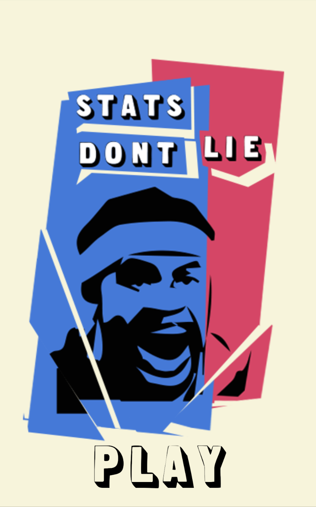
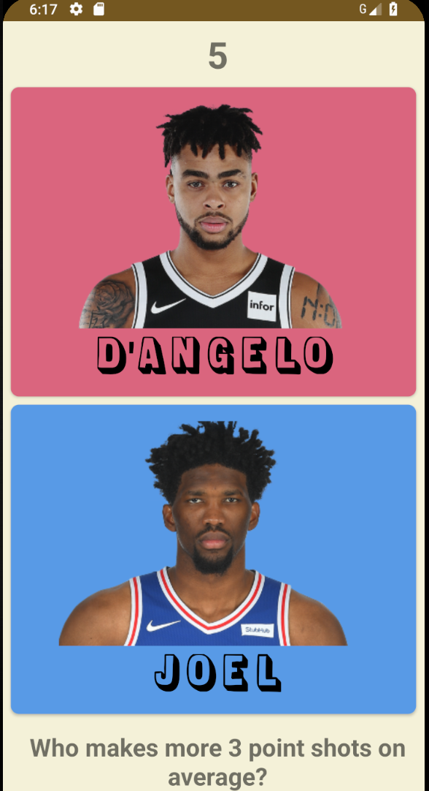
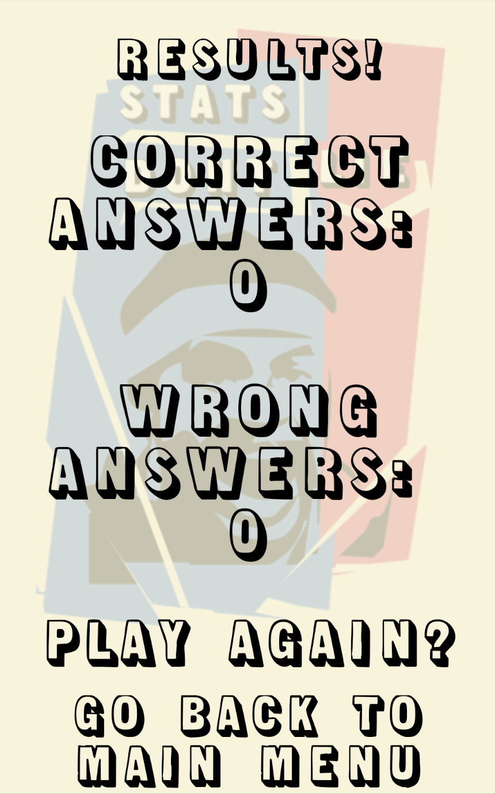

# Stats_Dont_Lie_Hackathon

This app contains a time attack feature that asks a user a series of questions and compares the stats of the individual players to see which stat best matches the given question. At the end of the time attack, there is a results screen indicating how many questions the user got right and wrong.

Main Screen            |  Game
:-------------------------:|:-------------------------:
  |  

Results             |
:-------------------------:
  |
